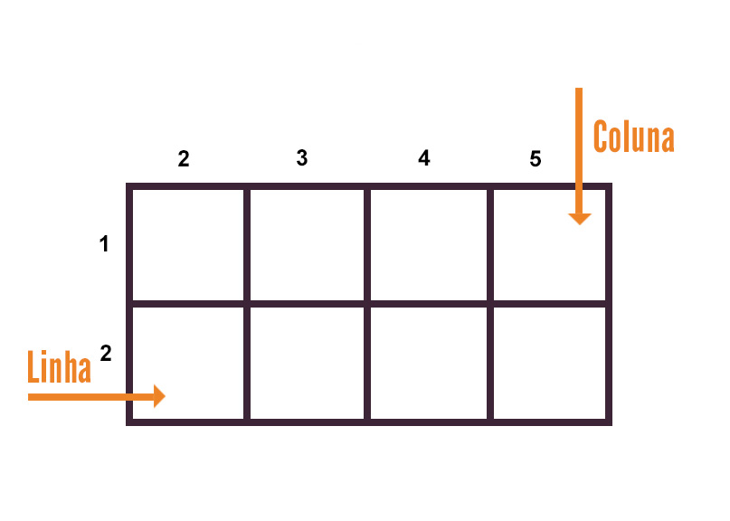

# Layout semelhante ao do youtube utilizando a função Grid do CSS

A contrução desse layout é fruto de um exercício passado no curso, tendo como base um modelo no figma. Sendo apenas um layout, é uma página estática, a qual no momento não possuí um vídeo principal e nem vídeos para navegação.

O Grid introduzum sistema bi-dimenssional de grades, facilitando a criação de layouts:

## Tecnologias Utilizadas:
- HTML
- CSS
